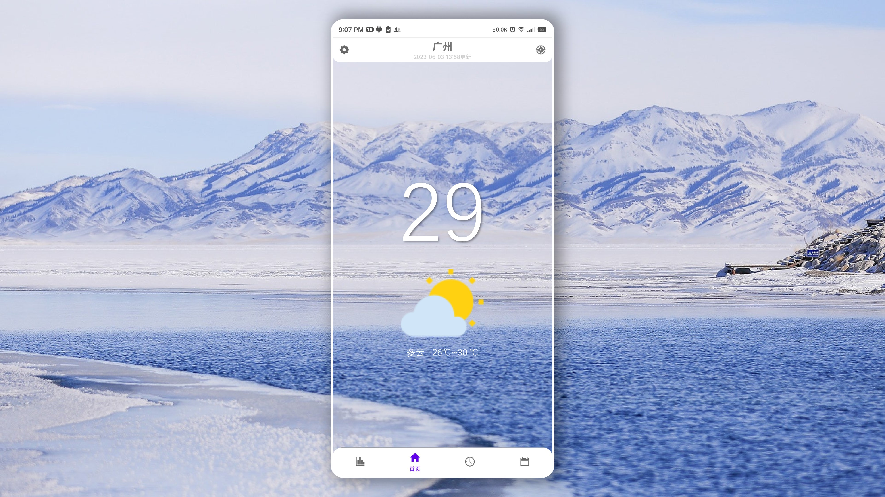
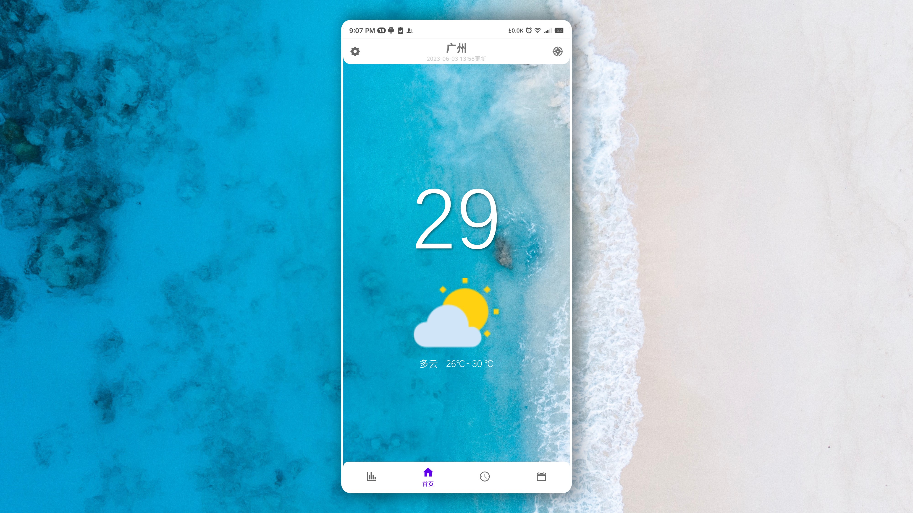
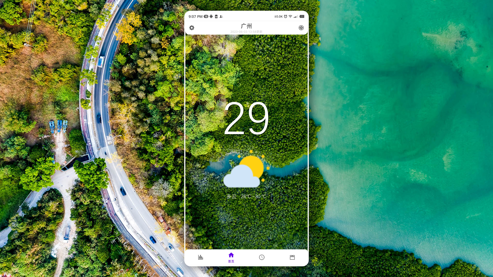
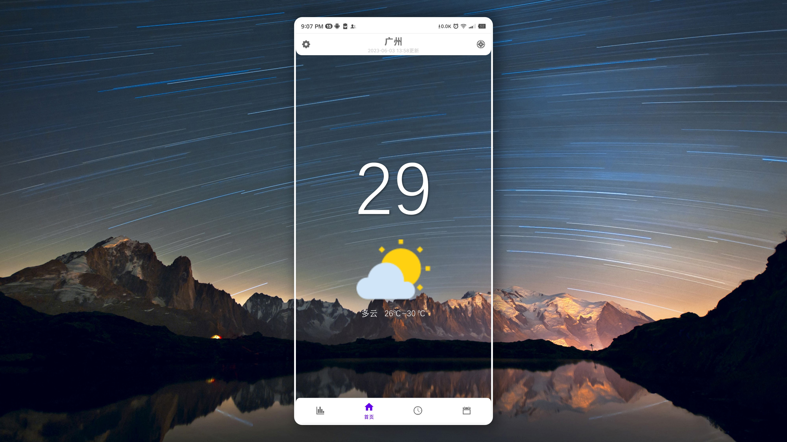
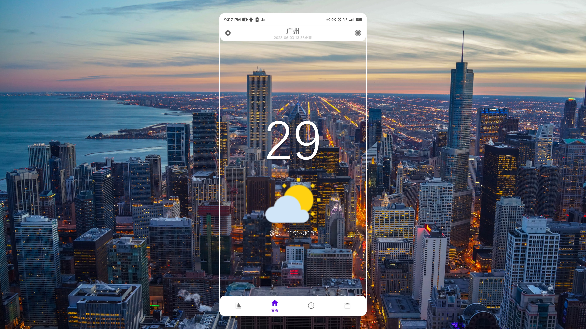
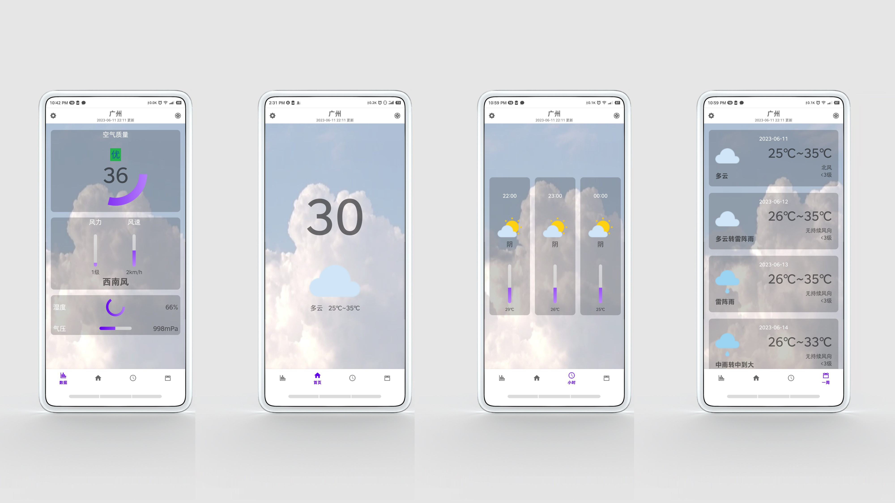
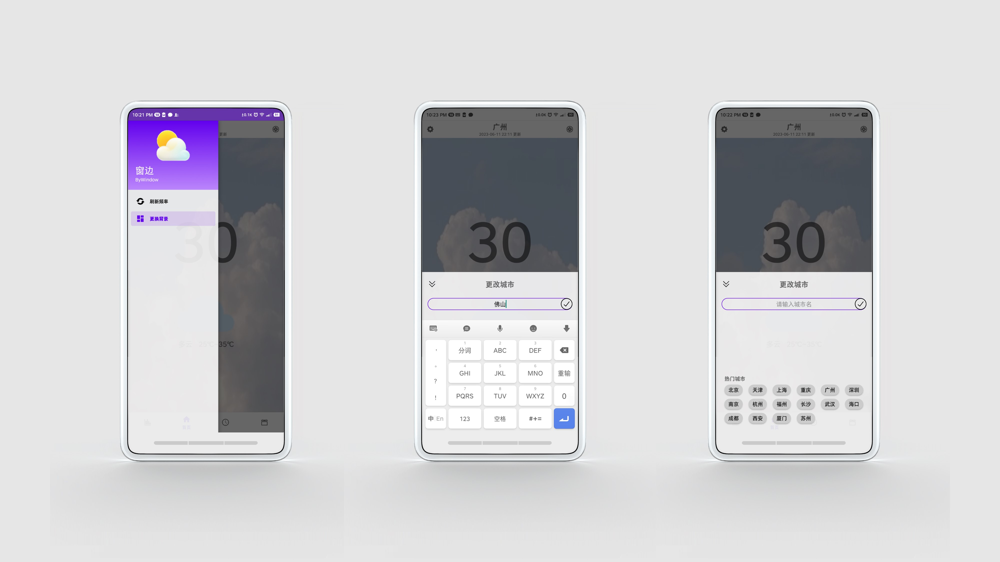

# ByWindow
一个十分简易的天气App

（关键词）***Android***

## 先看东西🤩
### 效果图

### 实机截图

## 有啥功能🧐
- 首页：查看当天天气的概览
- 数据：查看当天天气的详细数据
- 小时：查看后12小时，每小时天气的概览（*非真实数据，仅展示* ）
- 一周：查看后7天，每天天气的概览
- 初次打开App自动定位城市
- 更改城市：选择热门城市，或搜索城市名
- 通知栏显示当天天气的概览
- 设置：更换背景：  
  可选择不同天气展示不同的视频背景  
  还可选择自定义图片作背景（*仅展示* ）

## 大感谢🫡
### 教程
- 郭霖《第一行代码》第3版  
  第15章：进入实战，开发一个天气预报App

### 依赖库
- [Retrofit](https://square.github.io/retrofit/)
- [Gson](https://google.github.io/gson/)

### 数据
- [天气API](https://www.tianqiapi.com/)  
  免费基础实况天气、免费基础七日天气

### 素材
- 部分图标来自《第一行代码》
- 其余图标、所有照片、所有视频搜集自互联网

无商业用途！仅用作学习Android App开发，编写代码最终展示效果